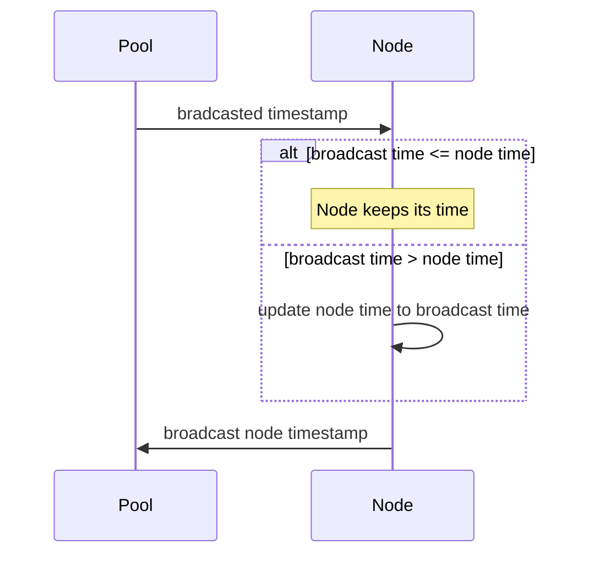

# Clock synchronization across unreliable nodes without consensus

_Note: This is a work in progress!_

## Purpose

The goal of this algorithm is to provide clock synchronization across a pool of
ignorant nodes (without consensus) across an unreliable, decentralized network.

Nodes are ignorant in the sense that they don't know if any other nodes exist
or persist any information about the outside world.

### Terms

__Node__: An self-contained instance

__Pool__: A graph of connected nodes

__Timestamp__: An incrementing count of time in a randomly-started epoch

## Algorithm

### Snychronization Process

1. The node receives a broadcasted timestamp
2. The node compares the received timestamp with its own
3. If the node's time is equal to or greater (later) than the received
  timestamp, it keeps its current time; if the received time is greater than
  the node's timestamp, the node updates its time to the received time
4. The node broadcast's its timestamp

## Situations to consider

* A pool starts together, with one or more nodes starting at the same time
* Two or more independent pools come together
* A pool starts together, then splits apart
* Arbitrary nodes fail
* Arbitrary nodes freeze, then come back online
* More?

## Outstanding questions

* When should a node broadcast its time?
* Does the algorithm above handle all situations?

## Work left

* Show that this will not result in time creep
